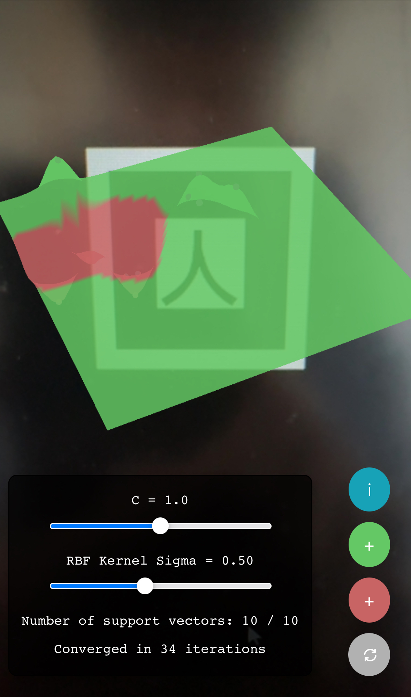

# AR-ML Fusion

**First time here? Go to: [Steps to Run](#steps-to-run)**
  
 

This is a tool to Visualize the Machine Learning concept of Support Vector Machines - Radial Basis Function. It trains a model with a dataset containing 2 distinct sets of data points using the SVM Radial kernel. The user can add more points to the data set and change training parameters to re-train the model. 

It is a cross-platform web-based tool that can run on a web browser on both Laptops and Mobile Phones. It is an Image Marker-based AR application and uses the Kanji Image marker.

**Made with ❤️ by Deep Shah at eCampus SJSU**

## Kanji Image Marker 

 

 

## Steps to Run

1. Go to the webpage: [https://shah-deep2.github.io/SVM_AR](https://shah-deep2.github.io/SVM_AR/)
2. Grant all the permissions asked including access to the camera. This is required.
3. Point the camera towards the [Kanji Image Marker](#kanji-image-marker) such that it is fully visible in the camera.
4. A pre-trained 3D model for SVM-RBF should appear on the screen on top of the Kanji Image Marker.
5. On a mobile device, use your fingers to rotate and zoom in/out the model. On a laptop/computer, use the mouse cursor to rotate the model.
6. Click the red/green buttons with a plus sign (+) to add new red/green data points to the model. Click again for every data point you want to add.
7. Press the grey re-model button (below the red button) to re-train the ML model and re-render the plot.
8. Click the (i) info button to hide/show the info related to the model.
9. When model info is visible after pressing the (i) button, you can control the parameters _**C**_ and _**σ**_ with the help of a slider.
10. Moving the sliders to change _**C**_ or _**σ**_ automatically re-trains the model.
11. Play around with the tool by adding different data points and testing different parameters.

 

## Output

### 3D Model

<!--  -->

 

### Full Application View on Mobile Phone

<!--  -->

